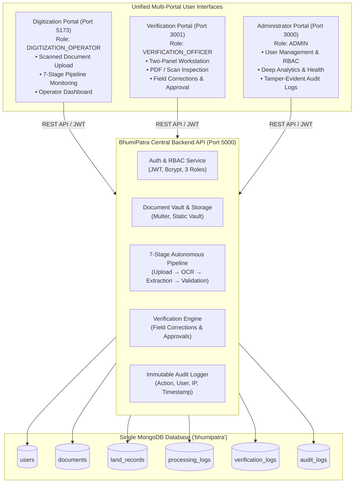

# BhumiPatra (भूमिपत्र)
### AI-Powered Intelligent Land Record Digitization & Validation System

BhumiPatra is an enterprise-grade, end-to-end platform for digitizing, extracting, validating, and managing legacy Indian land records (Khatauni, Khasra, Jamabandi, Mutation registers, and Sale Deeds).

The system integrates four production components into a single, cohesive architecture:
1. **Central Backend API** (`/backend`) — Node.js, Express, MongoDB, Mongoose, JWT, Multer.
2. **Digitization Portal** (`/digitization-portal/frontend`) — For **Digitization Operators** (Port 5173).
3. **Verification Portal** (`/verification-portal/frontend`) — For **Verification Officers / Tehsildars** (Port 3001).
4. **Administrator Portal** (`/admin-portal/frontend`) — For **System Administrators** (Port 3000).

---

## 🏛️ System Architecture



---

## ⚡ Port & Service Mapping

| Component | Directory | Port | Default URL | Primary Role |
| :--- | :--- | :--- | :--- | :--- |
| **Backend API** | `/backend` | `5000` | `http://localhost:5000` | API / All Roles |
| **Digitization Portal** | `/digitization-portal/frontend` | `5173` | `http://localhost:5173` | `DIGITIZATION_OPERATOR` |
| **Verification Portal** | `/verification-portal/frontend` | `3001` | `http://localhost:3001` | `VERIFICATION_OFFICER` |
| **Administrator Portal** | `/admin-portal/frontend` | `3000` | `http://localhost:3000` | `ADMIN` |

---

## 🔐 Zero Dummy Data & Initial System Bootstrap

BhumiPatra follows a strict **Zero Dummy Data** policy:
- No hardcoded users, records, or artificial statistics are seeded.
- Dashboards and queues show pristine empty states when no records exist.
- To initialize the first system administrator without manual MongoDB intervention, use either:

### Option A: Command-Line Bootstrap (Recommended)
```bash
npm run setup-admin
```
This initializes:
- **Email**: `admin@bhumipatra.gov.in`
- **Password**: `BhumiPatra@Admin2026`
- **Role**: `ADMIN`

### Option B: REST API One-Time Setup Endpoint
```bash
curl -X POST http://localhost:5000/api/auth/setup \
  -H "Content-Type: application/json" \
  -d '{
    "name": "Super Administrator",
    "email": "admin@bhumipatra.gov.in",
    "password": "BhumiPatra@Admin2026",
    "department": "Land Records & Revenue Department"
  }'
```
> **Security Note**: This endpoint only operates when `User.countDocuments() === 0`. Once an administrator exists, all subsequent requests return `403 Forbidden`.

---

## 🚀 Quick Start Guide

### 1. Prerequisites
- Node.js (v18+ recommended)
- MongoDB running locally at `mongodb://localhost:27017`

### 2. Install Dependencies
```bash
# Install backend dependencies
cd backend && npm install && cd ..

# Install frontend dependencies
cd admin-portal/frontend && npm install && cd ../..
cd verification-portal/frontend && npm install && cd ../..
cd digitization-portal/frontend && npm install && cd ../..
```

### 3. Bootstrap Initial Administrator
```bash
npm run setup-admin
```

### 4. Start Development Servers
Run each in a separate terminal:

```bash
# Terminal 1: Backend API (Port 5000)
npm run dev:backend

# Terminal 2: Administrator Portal (Port 3000)
npm run dev:admin

# Terminal 3: Verification Officer Portal (Port 3001)
npm run dev:verification

# Terminal 4: Digitization Operator Portal (Port 5173)
npm run dev:digitization
```

---

## 🔄 End-to-End Workflow Verification

A complete automated end-to-end integration test is provided in `backend/src/scripts/testWorkflow.js`:

```bash
npm run test:integration
```

This automated test executes and validates the entire operational lifecycle:
1. **Health Check**: Validates `/api/health` status.
2. **Setup Guard**: Verifies `POST /api/auth/setup` denies duplicate admin creation (403).
3. **Admin Authentication**: Logs in as `ADMIN` and fetches live database metrics.
4. **User Creation**: Admin creates `DIGITIZATION_OPERATOR` and `VERIFICATION_OFFICER` accounts.
5. **RBAC Verification**: Confirms Operator cannot access Admin dashboard (403) and Officer cannot create users (403).
6. **Document Upload**: Operator uploads a scanned PDF/image via multipart form data (`POST /api/documents/upload`).
7. **AI Pipeline Execution**: Autonomous 7-stage processing executes (`Upload → Preprocessing → OCR → Extraction → Validation → Scoring → Completed`).
8. **Officer Workstation**: Officer pulls pending queue (`GET /api/land-records/pending`), inspects the two-panel view, makes an in-line field correction with justification (`PUT /api/land-records/:id`), and approves the record (`POST /api/land-records/:id/approve`).
9. **Tamper-Evident Audit Trail**: Verifies that user logins, document uploads, pipeline runs, corrections, and approvals are stored in `audit_logs` and `verification_logs`.

---

## 📊 7-Stage Autonomous AI Pipeline

When an operator uploads a legacy land record, the document transitions through 7 distinct pipeline stages:

1. **UPLOAD** — File validated, assigned unique ID (`DOC-YYYYMMDD-XXXXXXXX`), securely stored in `/uploads/documents`.
2. **PREPROCESSING** — Image normalization, contrast enhancement, rotation correction.
3. **OCR** — Optical Character Recognition extract textual content in Hindi/English.
4. **EXTRACTION** — Structured entity extraction (Khasra No, Khatauni No, Khewat No, Area, Land Classification, Tenure Holders/Owners, Share Ratios).
5. **VALIDATION** — Rule-based checks (required fields, format standards, mathematical consistency of area and shares).
6. **CONFIDENCE ANALYSIS** — Field-level and composite confidence scoring (0-100%). High confidence (≥80%) and Low confidence (<80%) classification.
7. **COMPLETED** — Creates a corresponding `LandRecord` in `NEEDS_VERIFICATION` / `PENDING` state and notifies the verification queue.

---

## 📑 Verification Workstation (Port 3001)

Designed specifically for **Tehsildars** and **Revenue Officers**:
- **Split-Screen Interface**: Left panel displays original scanned document (zoom, pan, rotate); Right panel displays AI-extracted fields with confidence scores.
- **In-Line Field Correction**: Officer can edit any extracted value. Every modification requires a stated reason and is recorded in `verification_logs`.
- **Three Core Decisions**:
  - **Approve**: Marks record as `VERIFIED` with official seal and remarks.
  - **Reject**: Marks record as `REJECTED` with specific rejection reason.
  - **Send Back**: Returns document to `DIGITIZATION_OPERATOR` for rescanning or correction.

---

## 🛡️ Security & Governance

- **JSON Web Tokens (JWT)**: Cryptographically signed tokens with configurable expiration (`JWT_EXPIRES_IN=7d`).
- **Role-Based Access Control (RBAC)**: Centralized middleware guards enforce strict separation of duties.
- **Rate Limiting**: Configured across auth, document upload, and general API endpoints.
- **CORS Protection**: Whitelists only the three authorized portal origins.
- **Helmet Security Headers**: Protection against XSS, clickjacking, and mime-sniffing.
- **Audit Logging**: Every sensitive action (login, logout, upload, pipeline trigger, field edit, approval) creates an immutable record in `audit_logs`.
